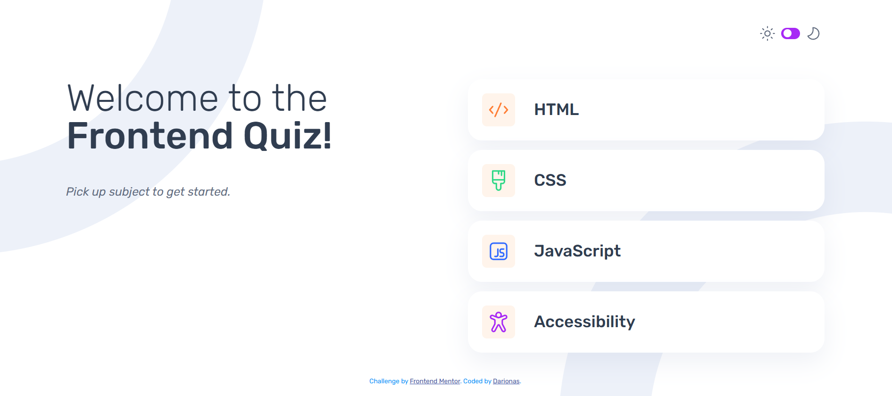

# Frontend Mentor - Frontend quiz app solution

This is a solution to the [Frontend quiz app challenge on Frontend Mentor](https://www.frontendmentor.io/challenges/frontend-quiz-app-BE7xkzXQnU). Frontend Mentor challenges help you improve your coding skills by building realistic projects. 

## Table of contents

- [Overview](#overview)
  - [The challenge](#the-challenge)
  - [Screenshot](#screenshot)
  - [Links](#links)
- [My process](#my-process)
  - [Built with](#built-with)
  - [What I learned](#what-i-learned)
  - [Continued development](#continued-development)
  - [Useful resources](#useful-resources)
- [Author](#author)
- [Acknowledgments](#acknowledgments)

## Overview

### The challenge

Users should be able to:

- Select a quiz subject
- Select a single answer from each question from a choice of four
- See an error message when trying to submit an answer without making a selection
- See if they have made a correct or incorrect choice when they submit an answer
- Move on to the next question after seeing the question result
- See a completed state with the score after the final question
- Play again to choose another subject
- View the optimal layout for the interface depending on their device's screen size
- See hover and focus states for all interactive elements on the page
- Navigate the entire app only using their keyboard
- **Bonus**: Change the app's theme between light and dark

### Screenshot

### Links

- Solution URL: [Frontend quiz app UI solution](https://github.com/Darionas/Frontend-quiz-app)
- Live Site URL: [Frontend quiz app UI live site](https://darionas.github.io/Frontend-quiz-app/)

## My process

### Built with

- Semantic HTML5 markup
- CSS custom properties (mobile-first workflow)
    - Flexbox
    - CSS Grid
- JavaScript (fetch JSON)

But created with :heart:

### What I learned

to work with design files
- use custom properties and utility classes
- To style a toggle button when it receives focus via the Tab key (keyboard navigation).
- create light-dark mode in css and javaScript. Load mode kept in localStorage, even after page refresh or if you open that page in a while.

### Continued development

- Continue learning Figma to work with design files

### Useful resources

- [Light-Dark toggle with CSS & JS (with Kevin Powell)](https://www.youtube.com/watch?v=wodWDIdV9BY) - A look at how to create a dark mode toggle switch using CSS & JS, which saves the person's preference in localStorage for the next time they visit.

## Author

- Frontend Mentor - [@Darionas](https://www.frontendmentor.io/profile/Darionas)
- GitHub - [Darionas](https://github.com/Darionas)

## Acknowledgments

- Thank you Frontend Mentor team for opportunity to try, practice, train yourself in different level challenges and gain invaluable experience.
